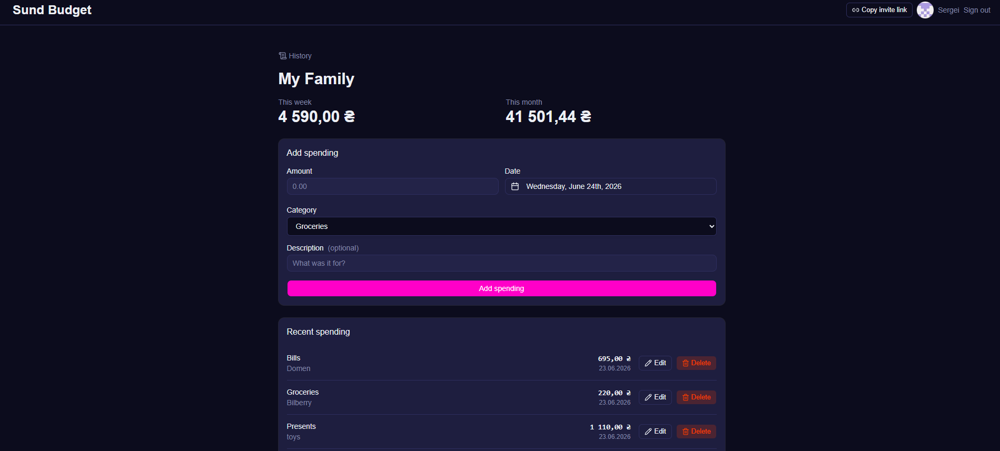
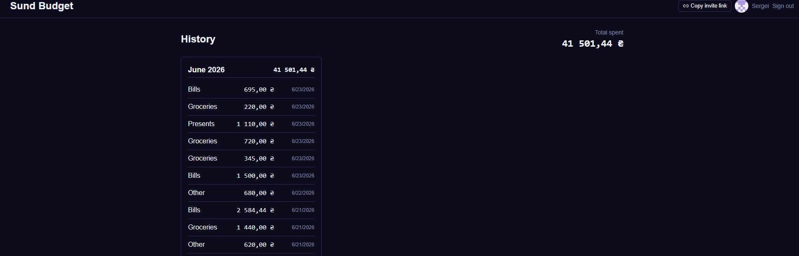

# Sund Budget

A shared household budget tracker for couples — log spending, categorize it, and see where the money goes. Built for my wife and me; she uses it daily.

**Live:** https://sund-budget.vercel.app


 
  

## Features

- **Google / GitHub sign-in** (NextAuth v5)
- **Multi-tenant households** — two partners share one budget, equal access
- **Invite flow** — generate a shareable link; partner clicks, signs in, and joins (callbackUrl preserved through auth)
- **Spending CRUD** — amount, date (custom date picker), category, description, with inline editing
- **Categories CRUD** — default categories seeded on household creation; inline rename; cascade delete
- **Week & month totals** + a **spending-by-category donut chart** (Recharts)
- **History view** — spending grouped by month with per-month and grand totals
- **Toast notifications** on every action (sonner)
- **Responsive** — mobile-first; works on the phone she actually uses

## Tech stack

| Area | Choice |
|------|--------|
| Framework | Next.js 16 (App Router, Server Actions) |
| Language | TypeScript |
| DB / ORM | PostgreSQL (Neon) + Prisma 7 (`@prisma/adapter-pg`) |
| Auth | NextAuth v5 (GitHub + Google OAuth) |
| Styling | Tailwind CSS v4 + shadcn/ui |
| Charts | Recharts |
| Toasts | sonner |
| Dates | date-fns |
| Tests | Vitest |
| Hosting / CI | Vercel + GitHub Actions (lint · build · test) |

## Architecture highlights

- **Server Actions for all mutations**, each with auth + household-ownership checks — a user can only touch data in their own household, and category references are validated against the household (prevents cross-tenant / IDOR access).
- **Pure aggregation functions** (`src/lib/aggregate.ts`) extracted out of components so the grouping/summing logic is unit-tested in isolation — no rendering, no DB mocks.
- **Server/client boundary handling** — Prisma `Decimal` values are serialized to `number` before crossing into client components.
- **Auth-aware middleware** preserves the intended destination through sign-in via `callbackUrl`, so invite links survive the login round-trip.

## Running locally

```bash
npm install
```

Create a `.env` (see `.env.example`):

```
DATABASE_URL="postgresql://..."        # Neon or any Postgres
AUTH_SECRET="..."                       # openssl rand -hex 32
AUTH_GITHUB_ID="..."
AUTH_GITHUB_SECRET="..."
AUTH_GOOGLE_ID="..."
AUTH_GOOGLE_SECRET="..."
```

OAuth callback (local): `http://localhost:3000/api/auth/callback/{github|google}`

```bash
npx prisma migrate dev    # apply schema
npm run dev               # http://localhost:3000
```

## Testing

```bash
npm test                  # vitest — unit tests for aggregation logic
```

## Scripts

| Command | Does |
|---------|------|
| `npm run dev` | Dev server |
| `npm run build` | Production build |
| `npm run lint` | ESLint |
| `npm test` | Run unit tests |